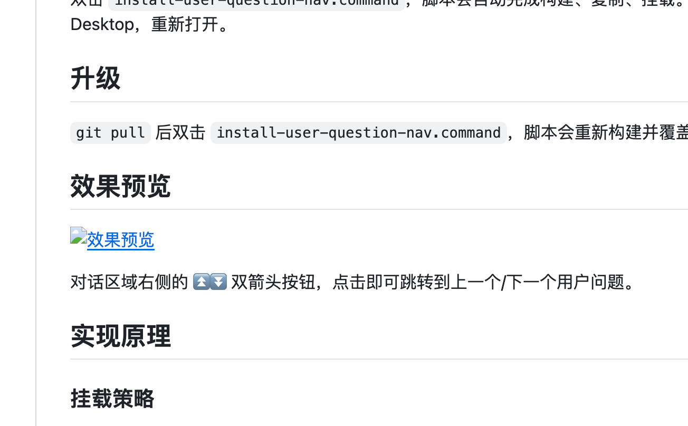

# dsh-user-question-nav

在 DeepSeek Harness 对话中快速定位上一个/下一个用户问题。点击浮动按钮（⏫⏬）自动滚动到对应位置，告别手动滑动查找。

## 解决了什么问题

在长对话中，用户问题（你的提问）散落在大量 AI 回复之间。想回顾「我之前问了什么」只能手动滚动，效率很低。

这个插件在对话区域右侧添加两个浮动按钮：
- **⏫ 上一个问题**：跳转到当前视口上方最近的用户问题
- **⏬ 下一个问题**：跳转到当前视口下方最近的用户问题

目标消息会被滚动到视口中间，方便阅读上下文。

## 安装

### 方式一：从 npm 一键安装（推荐）

要求：已安装并运行过一次 [DeepSeek Harness Desktop](https://github.com/anywhere-labs/deepseek-harness-desktop)。

```bash
dsh plugin --profile desktop add dsh-user-question-nav
```

完成后 **Cmd+Q** 退出 DSH Desktop，重新打开。

### 方式二：从源码安装（开发者）

适合修改源码、二次开发：

```bash
git clone git@github.com:xiaomujiang/dsh-user-question-nav.git
cd dsh-user-question-nav
pnpm install && pnpm build
./install-user-question-nav.command
# Cmd+Q 退出 DSH Desktop，重新打开
```

## 升级

```bash
dsh plugin --profile desktop add dsh-user-question-nav@latest
```

完成后重启 DSH Desktop。

## 卸载

```bash
dsh plugin --profile desktop remove dsh-user-question-nav
```

## 效果预览



对话区域右侧的 ⏫⏬ 双箭头按钮，点击即可跳转到上一个/下一个用户问题。

## 实现原理

### 挂载策略

`apply()` 中**立即创建按钮 DOM 并挂载到 `document.body`**，不等待对话区域出现。默认定位在视口右侧中间，然后异步查找对话滚动容器 (`[data-conversation-scroll]`)，找到后自动校准位置到对话区右侧边缘。

### 导航逻辑

1. 通过 `[data-chat-flow-kind="user"]` 选择器定位所有用户消息
2. 用**消息中心位置**（而非顶部）判断跳转目标，避免连续点击时选中同一消息
3. `scrollTo({ behavior: 'smooth' })` 平滑滚动到视口中间

### 会话切换

- `MutationObserver` 监听 DOM 变化，检测 scrollport 的 `isConnected` 状态
- 切换会话时旧 scrollport 断开 → 自动回退到默认位置 → 轮询等待新 scrollport 出现 → 重新挂载

### 边界反馈

到达第一个/最后一个问题时，按钮变半透明但仍可点击。点击时弹出气泡提示「已经是第一个问题」/「已经是最后一个问题」，1.5 秒自动消失。

### 图标区分

使用**双箭头**（⏫⏬）而非单箭头，与 DSH 自带的「回到底部」按钮（↓）明确区分。

## 开发

```bash
pnpm install        # 安装依赖
pnpm build          # 构建
pnpm typecheck      # 类型检查
```

## 结构

```
dsh-user-question-nav/
├── dsh.plugin.json        # DSH 插件清单
├── package.json           # npm 包元数据 + dsh.client 配置
├── cordis.patch.yml       # 挂载声明
├── tsconfig.json          # TypeScript 配置
├── tsdown.config.ts       # 构建配置（host + 两个 client bundle）
├── install-user-question-nav.command  # 一键安装脚本
└── src/
    ├── index.ts           # Host 端（空壳）
    ├── invariant.ts       # 不变量
    └── client/
        └── index.ts       # 客户端逻辑（按钮 + 导航）
```

## 参考项目

本插件在以下开源项目的基础上开发：

- [deepseek-harness-desktop](https://github.com/anywhere-labs/deepseek-harness-desktop) — DeepSeek Harness 桌面客户端
- [DSH-better-sidebar](https://github.com/omdsh-dev/DSH-better-sidebar) — DSH 侧边栏插件，本插件的挂载策略参考了该项目

## 贡献

欢迎提 Issue和 PR！

- **Bug 报告**：使用 [Bug 报告模板](https://github.com/xiaomujiang/dsh-user-question-nav/issues/new?template=bug_report.md)
- **功能请求**：使用 [功能请求模板](https://github.com/xiaomujiang/dsh-user-question-nav/issues/new?template=feature_request.md)

**PR 流程**：

```bash
git checkout dev
git checkout -b feat/your-feature    # 或 fix/your-bugfix
# ... 修改代码 ...
git commit -m "feat: 你的功能"
git push -u origin feat/your-feature
# 在 GitHub 上创建 PR → base: dev
# review 通过后合并到 dev
# 稳定后从 dev 合并到 main 发版
```

## 许可

MIT